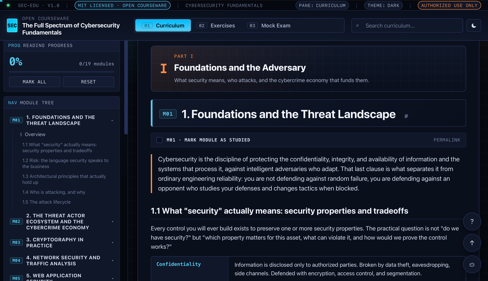

<div align="center">
  <h1>Free Course on Cybersecurity Fundamentals</h1>
  <p>
    <a href="#"></a>
    <a href="#"></a>
    <a href="#"></a>
    <a href="#"></a>
  </p>
  <p><strong>A free, browser-based cybersecurity fundamentals course that covers cryptography, networks, web security, ATT&amp;CK, Mobile ATT&amp;CK, ATLAS, detection engineering, DFIR, malware, threat intelligence, DISARM, cloud, identity, governance, guided exercises, runnable Python checks, and a sampled mock exam.</strong></p>
</div>



## Repository Description

Use this GitHub repository description:

> MIT-licensed cybersecurity fundamentals course in one interactive HTML file, covering crypto, networks, web security, ATT&CK, DFIR, malware, CTI, DISARM, GRC, labs, exercises, and a sampled mock exam.

## Contents

- [Quick Start](#quick-start)
- [What Is Included](#what-is-included)
- [Course Structure](#course-structure)
- [Interactive Features](#interactive-features)
- [Exercises And Mock Exam](#exercises-and-mock-exam)
- [Keyboard Shortcuts](#keyboard-shortcuts)
- [Project Structure](#project-structure)
- [Responsible Use](#responsible-use)
- [License](#license)

## Quick Start

### 1. Read the course

There is nothing to build for reading the course.

```bash
open src/index.html          # macOS
xdg-open src/index.html      # Linux
start src/index.html         # Windows
```

You can also open the root `index.html`, which redirects to the course in `src/`.

Progress, exercise drafts, theme, and exam work are saved locally in your browser with `localStorage`.

### 2. Run the Python exercise checker

The Python exercises in pane `02 Exercises` use a local runner for deterministic checks. For Docker, Docker Desktop or the Docker daemon must be running.

```bash
docker build -t cyber-course-runner docker
docker run --rm -p 8787:8787 cyber-course-runner
```

Then open the course, go to `02 Exercises`, click `Check runtime`, and run the coding checks. The browser sends code only to `http://127.0.0.1:8787/run` on your machine. No LLM grading is used.

For local development without Docker, you can run the same runner directly:

```bash
python3 docker/runner.py
```

## What Is Included

- 19 curriculum modules with worked code examples in the lessons.
- A true module-by-module reading mode that isolates one module at a time.
- Search with all-match highlighting and previous/next navigation.
- A dedicated `02 Exercises` pane with section and format filters, 200+ practice items, multiple choice checks, open-response model answers, and runnable Python coding exercises.
- A separate `03 Mock Exam` pane with sampled attempts and 1000-point scoring.
- MITRE ATT&CK Enterprise, Mobile ATT&CK, and ATLAS teaching matrices.
- D3FEND countermeasure knowledge-graph structure mapped to ATT&CK-style defensive design.
- Threat intelligence interoperability: STIX 2.1, TAXII 2.1, MISP, OpenCTI, markings, confidence, expiry, and dissemination controls.
- DISARM Red and Blue influence-operation analysis for FIMI, hack-and-leak operations, Doppelganger-style media cloning, amplification, response, and evidence handling.

## Course Structure

| Part | Modules | Focus |
|---|---:|---|
| I. Foundations and the Adversary | 01-02 | Security properties, risk, threat actors, cybercrime economy |
| II. Technical Core | 03-06 | Cryptography, IAM, network security, traffic analysis, web application security |
| III. Offensive Operations | 07-08 | MITRE ATT&CK, Mobile ATT&CK, D3FEND, reconnaissance, exploitation, C2 |
| IV. Defensive Operations, Cloud, and Intelligence | 09-13 | SOC, detection engineering, DFIR, malware, cloud, containers, CTI, OSINT, STIX/TAXII, DISARM |
| V. Governance and Frontiers | 14-15 | GRC, AI security, ATLAS, OT/ICS, post-quantum migration |
| VI. Advanced Operations and Global Governance | 16-19 | Stuxnet, adversary modeling, practitioner tools, global cyber governance, references |

## Interactive Features

- Three top-level panes: Curriculum, Exercises, and Mock Exam.
- All-modules mode or module-by-module mode with previous and next navigation.
- Generated module tree and reading progress tracking.
- Embedded ATT&CK Enterprise, Mobile, and ATLAS matrices with technique detail panels.
- Saved drafts for open response and coding exercises.
- Light and dark themes.
- Copyable code blocks and answer reveal controls.

## Exercises And Mock Exam

The Exercises pane is for practice. It includes:

- Section and format filters so learners can drill all questions, one domain, or one format.
- Multiple choice questions with explanations.
- Open questions with model answers.
- Runnable Python exercises with function contracts, starter code, expected behavior, and automated tests.

The Mock Exam pane is separate and samples from the question bank instead of serving one fixed test.

## Keyboard Shortcuts

| Key | Action |
|---|---|
| `/` | Focus search |
| `1` | Curriculum |
| `2` | Exercises |
| `3` | Mock Exam |
| `m` | Toggle theme |
| `t` | Back to top |
| `j` | Next section or next module |
| `k` | Previous section or previous module |
| `Esc` | Close a dialog or unfocus an input |

## Project Structure

```text
Cybersecurity_Fundamentals/
+-- README.md
+-- LICENSE
+-- index.html
+-- docker/
|   +-- Dockerfile
|   +-- runner.py
+-- src/
    +-- index.html
    +-- assets/
        +-- overview.png
```

## Responsible Use

This course is intended for education, defensive learning, authorized security testing, and responsible research only. Offensive concepts are included so defenders can understand, detect, and counter real adversary behavior. Practice only in environments you own, operate, or have explicit written permission to assess.

## License

Released under the MIT License. You may use, modify, teach from, and redistribute this course, including commercially, as long as the copyright and license notice are preserved.
